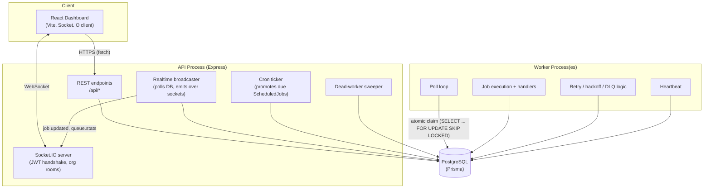
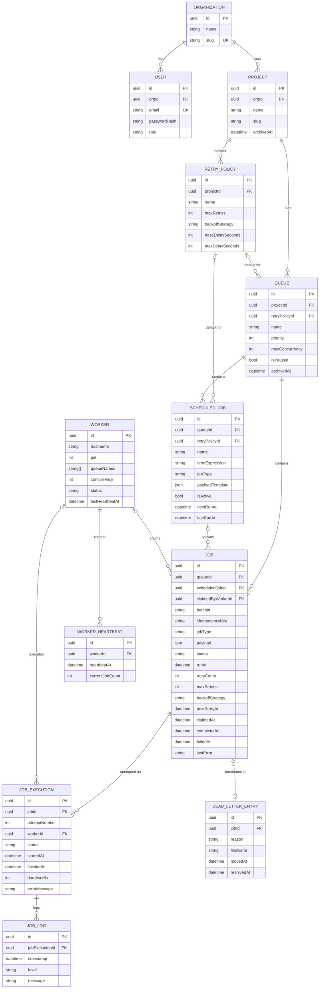

# Distributed Job Scheduler

A production-inspired distributed job scheduling platform — a small Sidekiq/Celery-style
system with a real-time dashboard. Built as an engineering exercise focused on
database design, concurrency correctness, API design, and maintainability.

**Live demo:**
- Dashboard: https://distributed-job-scheduler-orpin.vercel.app
- API: https://job-scheduler-api-4sax.onrender.com/health

> Both are on free hosting tiers and spin down after ~15 minutes of inactivity —
> the first request after idle can take up to a minute to wake them back up.
> This is a hosting-tier characteristic, not an application bug.

## What this is

- A **REST API** (Express/TypeScript) for managing organizations, projects, queues,
  retry policies, jobs (immediate/delayed/scheduled/batch), scheduled (cron) jobs,
  and a dead letter queue — with JWT auth and Zod-validated requests.
- A **worker process**, separate from the API, that polls for ready jobs, claims
  them atomically (no double-processing under concurrent workers), executes them,
  retries on failure with configurable backoff, and moves exhausted jobs to a
  dead letter queue.
- A **React dashboard** showing live queue/job/worker state over a Socket.IO
  connection, with charts, filtering, and manual queue/project management.
- **PostgreSQL** as the single source of truth, via Prisma, with one query
  (`packages/db/src/claim.ts`) doing the actual concurrency-critical work.

See [`design-decisions.md`](./design-decisions.md) for the reasoning behind the
schema, the claim query, retry/backoff, and the real-time layer — that document
is the "why", this one is the "how to run it".

## Architecture



The API and worker are independent processes that never talk to each other
directly — they only communicate through Postgres. This is what makes the
worker horizontally scalable: `docker compose up --scale worker=3` runs three
independent pollers safely, because the claim query (not application-level
locking) is what prevents double-processing.

## Entity-relationship diagram



## Tech stack

| Layer | Tech |
|---|---|
| API | Node.js, TypeScript, Express, Zod, JWT (jsonwebtoken), bcrypt, pino |
| Worker | Node.js, TypeScript — separate process, same DB layer |
| Database | PostgreSQL, Prisma ORM (raw SQL for the atomic claim query) |
| Dashboard | React, TypeScript, Vite, Tailwind CSS v4, React Query, Recharts, Socket.IO client |
| Real-time | Socket.IO, JWT-authenticated handshake, org-scoped rooms |
| Testing | Vitest, Supertest, real Postgres (no mocked DB) |
| Infra | Docker Compose (local), Render (API + worker + Postgres), Vercel (dashboard) |

## Monorepo layout

```
apps/
  api/      Express API
  worker/   Standalone worker process
  web/      React dashboard (Vite)
packages/
  db/       Prisma schema, client, migrations, the atomic claim query
  shared/   Types/constants shared between api, worker, and web
```

## Running locally

Requires Docker and Docker Compose.

```bash
git clone https://github.com/Abhinav2324-tech/distributed-job-scheduler.git
cd distributed-job-scheduler
cp .env.example .env       # defaults work as-is for local use
docker compose up
```

This starts, in order: Postgres → a one-shot `migrate` container (runs
`prisma migrate deploy`, then exits) → the API (:4000) → the worker → the
dashboard (:5173, proxied through nginx to port 80 internally).

Once it's up:
- Dashboard: http://localhost:5173
- API health check: http://localhost:4000/health
- API docs (Swagger UI): http://localhost:4000/api-docs

Register an account from the dashboard's Register page — the first user in a
new organization becomes its admin. From there: create a project, create a
queue, submit jobs, and watch them get claimed and processed live.

To run multiple worker instances against the same queues:

```bash
docker compose up --scale worker=3
```

### Running without Docker (for development)

```bash
npm install
npm run db:migrate --workspace @jobscheduler/db   # requires a local Postgres; see packages/db/.env
npm run dev:api      # apps/api,    :4000
npm run dev:worker   # apps/worker, background process
npm run dev:web      # apps/web,    :5173
```

Each app reads its own `.env` (see `apps/*/​.env.example`).

## Testing

```bash
npm test
```

Runs Vitest across all workspaces. Notably:
- `packages/db/src/__tests__/claim.test.ts` — the concurrency test: spins up
  many simulated concurrent claimers against a shared job pool and asserts no
  job is ever claimed twice and per-queue `maxConcurrency` is respected.
- `apps/api/src/__tests__/*` — route-level tests against a real Postgres
  instance (TRUNCATE-based reset between tests, not mocks).
- `apps/worker/src/__tests__/*` — backoff computation, execution, and queue
  resolution logic.

Tests run against a real database (see `DATABASE_URL` in each package's
`.env` / CI config) rather than a mocked Prisma client, specifically so the
claim-query concurrency test exercises real Postgres locking behavior.

## API documentation

Full endpoint reference: [`openapi.yaml`](./openapi.yaml) (OpenAPI 3.0). When
the API is running, an interactive Swagger UI is served at `/api-docs`
(e.g. http://localhost:4000/api-docs or
https://job-scheduler-api-4sax.onrender.com/api-docs).

Auth: obtain a token from `POST /api/auth/login` or `/api/auth/register`,
then send it as `Authorization: Bearer <token>` on every other request. Almost
every resource is scoped to the caller's organization via that token — the one
exception is `GET /api/workers`, since a worker fleet is shared operational
infrastructure rather than tenant data (see `design-decisions.md` §4).

## Deployment

The live demo above is deployed as follows; see `render.yaml` and
`vercel.json` for the exact config.

- **Database + API + worker → Render**, from a single Blueprint
  (`render.yaml`) that provisions a Postgres instance, the API as a Docker web
  service, and the worker as a second Docker web service (see
  `design-decisions.md` §6 for why the worker is a "web service" rather than a
  "background worker" — a free-tier constraint, not a design choice).
- **Dashboard → Vercel**, built from the monorepo root via `vercel.json`
  (`npm run build --workspace @jobscheduler/shared && npm run build
  --workspace @jobscheduler/web`, output `apps/web/dist`), with
  `VITE_API_URL`/`VITE_WS_URL` pointing at the Render API.

To redeploy your own copy: push to your fork, connect it to Render via
**New → Blueprint** (Render reads `render.yaml` automatically), then connect
the same repo to Vercel and set `VITE_API_URL`/`VITE_WS_URL` to your Render
API's URL. Finally, update `CORS_ORIGIN` on the Render API service to your
Vercel URL.

## Environment variables

See `.env.example` at the repo root (docker-compose defaults) and
`apps/{api,worker,web}/.env.example` for per-service local-dev values. Notable
ones:

| Variable | Where | Purpose |
|---|---|---|
| `DATABASE_URL` | api, worker, db | Postgres connection string |
| `JWT_SECRET` / `JWT_EXPIRES_IN` | api | Auth token signing |
| `CORS_ORIGIN` | api | Allowed dashboard origin |
| `WORKER_CONCURRENCY` | worker | Max jobs one worker instance runs at once |
| `WORKER_QUEUES` | worker | Comma-separated queue names to poll (empty = all) |
| `VITE_API_URL` / `VITE_WS_URL` | web (build-time) | Where the dashboard points its REST/WebSocket traffic |
